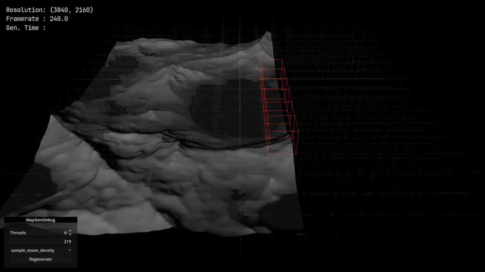
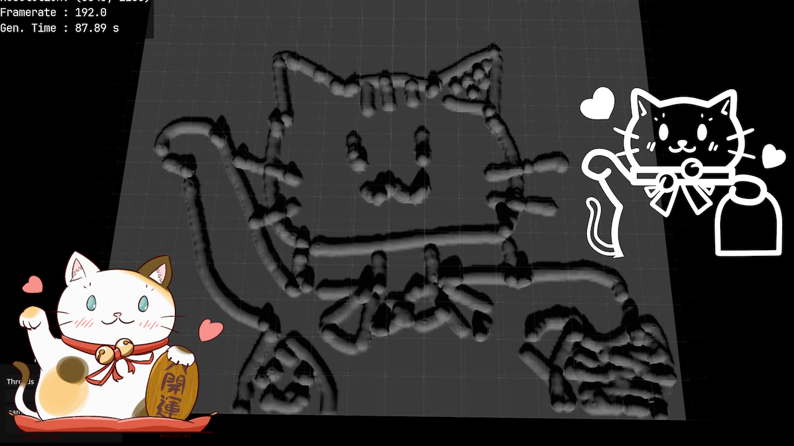
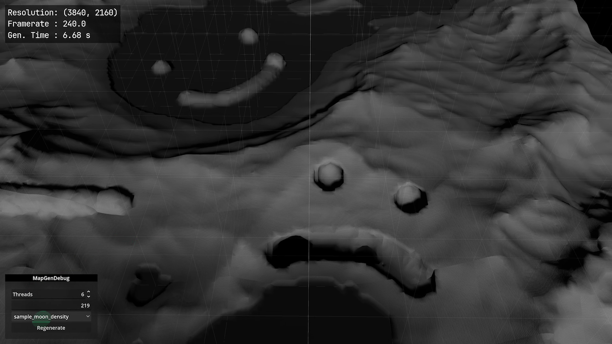

# Chunked & Threaded Marching Cube Generation / Update demo

[Live](https://jupiterbjy.github.io/ProjectIncubator-Godot/MarchingCubeChunked/build/) (you MUST refresh page AFTER OPENING)

[yt demo](https://youtu.be/ou6bHSG7Um8)

|  |  |
|-----------------------------|-----------------------------|
|   |   |

Preferably don't look inside shader, it's kinda terrible and broken.

Also src code structure is kinda since I wasn't really experienced(nor I am now tho) back then.
