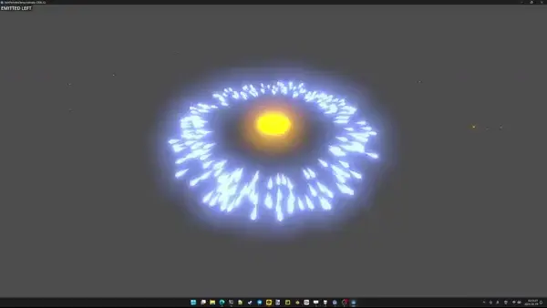

## DemocraticEmitter

Or just, unity-like emitter demo.

It's just (in single frame's perspective) groupped call on `GPUParticles3D.emit_particle`.

Project is in `Godot 4.3 Beta 1` but should be working in `4.0` too.
